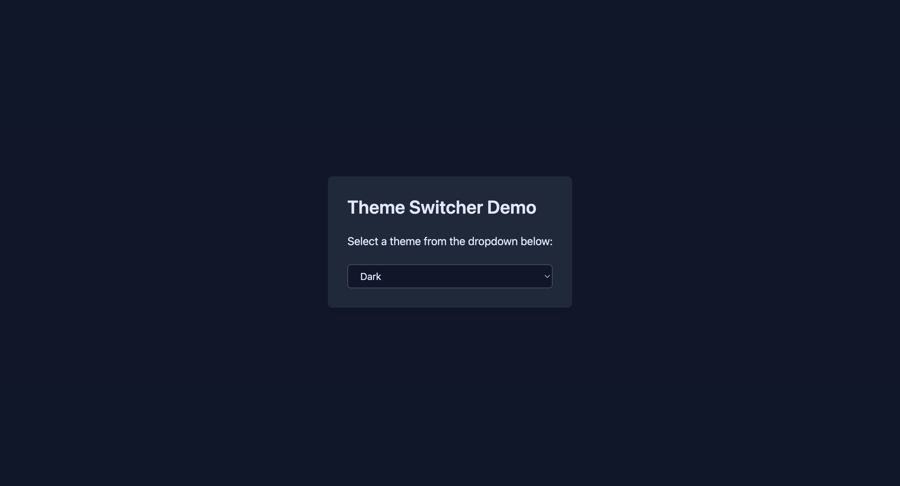

Sure! Here is a complete `README.md` file content based on your instructions:



````markdown
# Tailwind CSS with Vite and Custom Themes Setup

## Step 1: Create your project  
Start by creating a new Vite project. Use Create Vite for easy setup:

```bash
npm create vite@latest my-project
cd my-project
````

## Step 2: Install Tailwind CSS

Install `tailwindcss` and the Vite plugin `@tailwindcss/vite` via npm:

```bash
npm install tailwindcss @tailwindcss/vite
```

## Step 3: Configure the Vite plugin

Open `vite.config.ts` and add the Tailwind CSS plugin:

```ts
import { defineConfig } from 'vite'
import tailwindcss from '@tailwindcss/vite'

export default defineConfig({
  plugins: [
    tailwindcss(),
  ],
})
```

## Step 4: Import Tailwind CSS

In your main CSS file (e.g. `index.css`), import Tailwind CSS styles:

```css
@import "tailwindcss";
```

## Step 5: Start your build process

Run your development server:

```bash
npm run dev
```

## Step 6: Create your theme layers

In your CSS, create a **base layer** defining your theme variables:

```css
@layer base {
  /* Default (light) theme */
  :root {
    --background: #ffffff;
    --foreground: #020817;
    --primary: #1e40af;
    /* Add more variables here */
  }

  /* Dark theme */
  [data-theme="dark"] {
    --background: #020817;
    --foreground: #f8fafc;
    --primary: #ffffff;
    /* Add more variables here */
  }

  /* Green theme */
  [data-theme="green"] {
    --background: #a9f2b6;
    --foreground: #2b382a;
    --primary: #2b382a;
    /* Add more variables here */
  }
}
```

## Step 7: Connect your theme variables to Tailwind CSS

Define a theme layer mapping Tailwind variables to your CSS custom properties:

```css
@theme {
  --color-background: var(--background);
  --color-foreground: var(--foreground);
  --color-primary: var(--primary);
  /* Add more mappings here */
}
```

This allows you to use Tailwind utilities like `bg-background` or `text-primary` which respond to your active theme.

---

## Summary

* Create Vite project
* Install Tailwind CSS and its Vite plugin
* Configure Tailwind plugin in `vite.config.ts`
* Import Tailwind CSS in your CSS file
* Run your dev server
* Define CSS variables for themes in a base layer
* Map those variables for Tailwind usage
* Use `data-theme` attribute on `<html>` to toggle themes dynamically

---

## Reference

[Official Tailwind CSS + Vite installation guide](https://tailwindcss.com/docs/installation/using-vite)


Would you like me to generate this file for you as an actual `.md` file for download?
```
